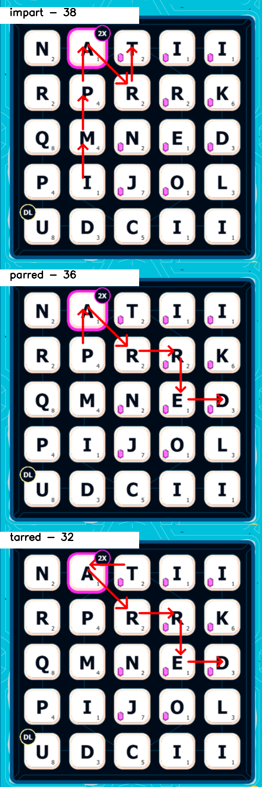
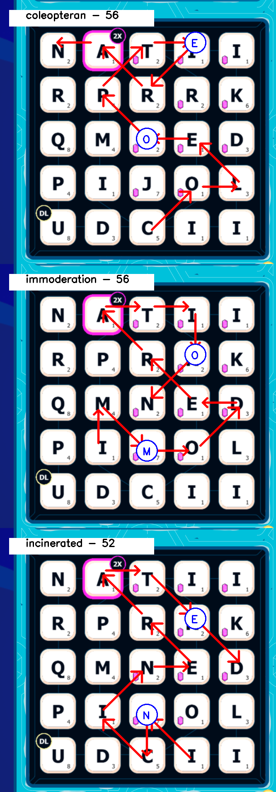

# SpellCastCheat_Console

Bored from cheaters? Become a cheater with SpellCast Cheat Console! This tool will help you find the biggest words and increase your English vocabulary.

## Instructions

### How to Run

1. **Configure or Use Default Settings**: You can change the configuration in `AppConfig` or use the default settings provided.

2. **Build the Project**: Build the project using your preferred method (e.g., Visual Studio, `dotnet build` command, etc.).

3. **Prepare the Output Folder**:
   - Navigate to the `bin/Debug/net6.0` or `bin/Release/net6.0` directory, depending on your build configuration.

4. **Run the Application**:
   - Run the `SpellCastCheat_Console.exe` executable located in the output directory.

5. **Capture Your Board**:
   - Take a screenshot of your SpellCast board and save it to the `Images` folder located next to the `.exe` file.
   - The cheat tool will automatically detect the new board screenshot, process it, and generate result images.

6. **View Results**:
   - The generated result images will open automatically in the default photo viewer. If they don't open, you can find the results in the `/Images/Results` folder.

### Example Result

**No Swap**

**Single Swap**

**Double Swap**

### Close the Console

When you are done, close the console window to exit the application. Use responsibly!

---

**Note:** This tool is for educational purposes only. Please use it responsibly and ethically.
